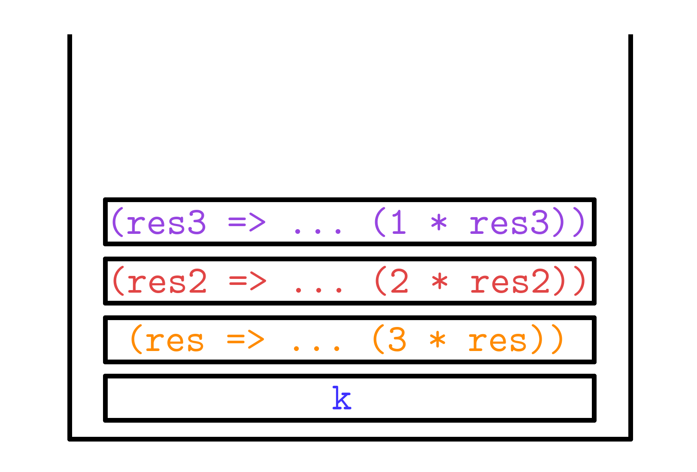

# Continuation Passing Style
We have seen how we can write functions that are _tail recursive_, in that they
only make recursive calls as _tail calls_, where the recursive calls is the last
thing that the function does (i.e. there is no deferred work). This commonly was
realized by implementing the tail-recursive function with an _accumulator_,
which simply stored the intermediate values that were computed. In this section,
we will explore an concept known as _continuation-passing style_, which sees the
use of _functions as accumulators_, which lets us use more explicit logic when
encoding the control flow of our programs, as well as the intermediate results
of our computations.

## Continuation Passing Style: The Idea
Consider the computation of `(2 + 3) * 4`.

Clearly, there is an ordering to how we should evaluate this. We should sum `2`
and `3` first, then take the _result of that_ and multiply it by `4`. There is
kind of a catch here, that is quickly glossed over by our human brains - we
refer to "the result of that" rather casually. We haven't explicitly named it,
but we nonetheless make an appeal to intuition to get our point across.

How else might we represent this computation? Well, we could use lambda
expressions, and then use the power of function application to compute the
result. Then, we might obtain that this is akin to evaluating `(fn res => res * 4)
(2 + 3)`. This would be a more direct translation of the idea of "add 2 and 3,
then pass the result of that to 4". We note that, in the process, we have
explicitly made clear what we mean by "the result of that" - it is now bound to
a name, that being `res`.

We can take this one step further. If we think about it a bit more, we might
want to consider starting at a "single" value, so that we don't have to consider
the operation of `2 + 3` as one step. Then, we might instead write "take 2, add
the previous result to 3, and then multiply the previous result by 4". Clearly,
we have now made it deliberate that we are passing around a _single value_ that
we are performing operations on at each step. How would we write this as a
lambda expression, however?

We might write `(fn res => (fn res2 => res2 * 4) (res + 3)) 2` to encode the
previous instructions. This essentially makes `res` the _first_ "previous
result", and then the result of `2 + 3` is `res2`, the _second_ "previous
result". Make sure you understand what is happening here - we are binding `2` to
the identifier `res`, then binding the result of `res + 3` to the identifier
`res2`.

However, it is still on us to provide the value of `2`. We to somehow encode the
notion of the _computation_ of `(2 + 3) * 4`, not necessarily evaluating the
expression ourselves. We know that placing an expression within the confines of
a lambda expression will "freeze" the computation, causing it to only resume
once the lambda expression is given an input, so what we can do is simply do the
same with a trivial input. Our trivial input here will be `()`, or unit, since
we always have access to it, and there is only one value of type `unit`.

So somehow, we can encode the idea of this expression with `(fn () => (fn res =>
(fn res2 => res2 * 4) (res + 3)) 2)`. Seen in this way, we have somehow encoded
the desired expression not by actually executing it, but forming some large
function _a priori_ that essentially does the same thing. We thus form a correspondence between evaluating an expression by _carrying out each step in real time_ and by _writing out the steps to be done at a later time_. We hope to show that two are really equivalent - this will be important to understand for later.


## Continuation Passing Style: A Case Study
We will now discuss continuation passing style more explicitly.

It is hopefully clear that the previous example of `(fn () => (fn res => (fn
res2 => res2 * 4) (res + 3)) 2)` encodes, in some form, the _idea_
of the computation of the expression `(2 + 3) * 4`. Somewhat key, however, is
that computation _does not execute_ until we actually feed a unit to it. It is
important to note the distinction between _doing something_ and _writing the
instructions to do something_. A continuation can be thought of as a
_blueprint_, or a _contingency plan_. We will expand more on what we mean by
this shortly, but a continuation essentially represents _what instructions need
to be executed_. This is a very powerful idea, because programs can continuously
alter continuations by adding more instructions or even executing different
continuations in order to determine what computations ultimately need to be
executed.

We will first consider a simple example before going into the definition.
```sml
(* factCPS : int -> (int -> 'a) -> 'a *)
(* REQUIRES: true *)
(* ENSURES: factCPS n k ~= k (n!) *)
fun factCPS 0 k = k 1
  | factCPS n k = factCPS (n-1) (fn res => k (n * res))
```

Here, `factCPS` takes in two arguments - one is the counter for the factorial
function (as normal), and the other is the _continuation_. In this case, the
continuation is a function from `int -> 'a`. The idea here is that the
continuation should represent what work is _left to do_. It is left polymorphic,
however, in order to give the user control over what they want the function to
do. In order to compute the factorial of `n` directly, one could just evaluate
`factCPS n Fn.id`, however we grant more versatility to the user in that they
are not _just_ constrained to computing the factorial. If one wanted a textual
representation of the factorial of `n`, they could evaluate `factCPS n
Int.toString`, for instance. This way, we get additional versatility out of our
implementation.

We will now consider a trace of `factCPS 3 Int.toString` to fully understand the
mechanism by which it works.

<figure class="aligncenter">
    
    <figcaption><b>Fig 1.</b> Code trace of the evaluation of `factCPS 3 Int.toString` </figcaption>
</figure>

As we can see, this code trace does correctly result in `Int.toString 6`, which
is our desired result. Of particular interest to our analysis is the
_continuation_ of the function, which seems to grow with every line through
`factCPS`'s recursion, until ultimately being reduced down step-wise until it
yields our final result. 

The colors in the image denote the difference between the _current_ value of `k`
and the new, _constructed_ k. For instance, `k` is originally `Int.toString`
(which is the blue-colored text), however it is eventually wrapped in `(fn res
=> ... (3 * res))`, which is the RHS of the call to `factCPS 3 Int.toString`.
Thus, the "inner" `k` in the third line is in orange, to signify that it is in
fact the same as the entire continuation from the previous line (also in
orange), which is the "previous" `k`. Seen in this way, all that each recursive
call seems to be doing is appending a layer to the continuation, while the
inside remains the same.

**NOTE:** The definition of `factCPS` says that the input to each lambda
expression should be named `res`. In order to make understanding clearer and
avoid namespace collisions, we have opted to name it `res`, `res2`, and `res3`,
on each recursive call to `factCPS`. Note that this renaming does not affect the
evaluation of `factCPS 3 Int.toString` and does keep it exactly equivalent to
how it is actually evaluated<a href="#footnote1"> <sup> [1] </sup> </a>.

So hopefully now we are convinced of `factCPS`'s correctness<a href="#footnote2"> <sup>[2]</sup> </a>. What might not be evident, however, is _why_. 

Recall our previous metaphor with regards to writing down instructions. It is
hopefully not too difficult to see that this large lambda expression that we are
constructing is akin to writing down instructions - we specify the operations
that should occur when it is ultimately "collapsed" (by being given an input
value), but nothing actually occurs until then. It merely encodes that
information in the meantime. The next diagram will attempt to more specifically
show this relationship between the "instructions" and how it arises from the
definition of `factCPS`:

<figure class="aligncenter">
    
    <figcaption><b>Fig 2.</b> Relationship between an arbitrary recursive call of `factCPS` and the "instructions" that it writes down. </figcaption>
</figure>

The middle of this image is supposed to denote the "instructions" that you might
write if you were to codify the algorithm to determine the factorial of \(n\).
Note that these instructions are actually read from bottom to top - thus, we
start with 1 and then work out way up multiplying until we reach \(n\), which
presumably should give us the actual factorial. 

Now consider if we were at some arbitrary point of execution of the expression
`factCPS n initK`, for some arbitrary `initK : int -> 'a`. That is, suppose that 
`factCPS n initK` has reduced down to `factCPS i k'`, for some other `k` (which 
is the result of modifying the continuation throughout the recursive calls of 
`factCPS` until now. Then, we should see that the form of `k` should look something 
like `(fn res => (fn res2 => ... (fn resn => initK (n * resn)) ... ((i + 2) * res))
((i + 1) * res))`. That is, it exactly captures the idea of the instructions in
orange - it covers the multiplication of all of the terms from \(i+1\) to \(n\). 

What is the action of the recursive call _at_ `factCPS i k`? Well, clearly it
should reduce to `factCPS (i-1) (fn res => k (i * res))` - that is, it wraps `k`
in the lambda expression `(fn res => k (i * res))`, which is just the
"instruction" to multiply the result by `i`, which exactly corresponds to the
instruction in blue.

How do we compute the rest of the factorial function? Everything seems correct
so far, but that is all that we will have in our accumulation of `k`. The rest
of the instructions are exactly corresponding to the recursive call - to
`factCPS i` itself. `factCPS i`, as the recursive call, will continue to go and
compute the factorial all the way down to 0. Thus, even though we have not
written them down yet, we can use the "recursive leap of faith" to _assume_ that
`factCPS i k` will behave properly, and write down the instructions for
multiplying `i-1` through `1` properly, which will result in the final, correct
result.

**NOTE:** An equivalent, but also very _important_ way to view CPS functions is
that recursive calls _pass their result_ to their continuation. For instance, as
we have defined, `factCPS n k` should be extensionally equivalent to `k (fact
n)`, or in other words, `factCPS n k` will be the same as passing the actual
factorial of `n` to `k`. This means that when we are writing our function, we
can make that assumption - `factCPS (n-1) (fn res => k (n * res))` should pass
the result of \((n-1)!\) to `(fn res => k (n * res))`. This is equivalent to, in
our "instructions" analogy, saying that `factCPS i k` should faithfully execute
all the instructions of multiplying from `1` to `i` - that is, `factCPS i k`
should pass the result of \(i!\) to `k`.

So now, we can sort of inductively see how `factCPS` writes down the entire page of
instructions, which should mean that it is correct when we execute it. This is
not an inductive proof in itself, but this should give the intuition for _why_
it does work.

An additional way to think about CPS functions is that they behave similarly to
a _stack_. This is because, as we have seen, we are continuously wrapping lambda
expressions with other lambda expressions - we can only "pop" off a lambda
expression by evaluating it with an argument, or "push" on more instructions by
wrapping our continuation in more lambda expressions. We cannot access the ones
inside. As such, we could visualize the evaluation of `factCPS 3 k`
as the following diagram:

<figure class="aligncenter">
    
    <figcaption><b>Fig 3.</b> A visualization of the "stack" of instructions created by evaluating `factCPS 3 k`. </figcaption>
</figure>

We would build this stack up from the bottom by first putting our `k` on (as our
"original" `k`), then wrapping it in more lambda expressions as we go along the
recursive calls (so, for instance, the orange brick is added by `factCPS 3 k'`, and
the red brick is added by `factCPS 2 k''`, for their own respective continuations
`k'` and `k''`). Then, once we are at the end, our "instruction stack" looks
like the one currently pictured. At that point, we have nothing left to do but
execute the stack of instructions with an initial value of `1`, which will cause
the bricks to start being popped off one by one, and then ultimately result in the 
value of `6` being applied to `k`. 

Another, equivalent way to view continuations is as _donuts_.

<figure class="aligncenter">
    
    <figcaption><b>Fig 4.</b> An artist's rendition of the "CPS Donut" of instructions created by evaluating `factCPS 3 k` (colorized, 2020). </figcaption>
</figure>

As you can see, we cannot access the inner layers of the CPS Donut without first
biting through the outer layers (corresponding to our evaluation of the outer
layers first). One can only imagine what it would taste like in real life.

**NOTE:** It is not important to be able to draw these examples, or parrot them
verbatim. They are merely here to try and provide some intuition as to what is
happening with CPS. It is very important to be able to understand _why_ it is
that CPS functions work, which may be rather daunting and hard-to-grasp at
first.

### Footnotes

<a id="footnote1"> [1]: In fact, it is
<a href="https://en.wikipedia.org/wiki/Lambda_calculus#Alpha_equivalence">_alpha equivalent!_</a> </a>

<a id="footnote2"> [2]: Though perhaps we should not be, until we write a full inductive proof of correctness! </a>

## Continuation Passing Style: The Definition

We are now ready to attempt a definition of continuation passing style.

> **[Continuation]** A _continuation_ is a function that specifies what is
> supposed to be done with the result of a computation.

> **[Continuation Passing Style]** A function is said to be written in
> _continuation passing style_ if it satisfies the following conditions:
> 
> 1. It takes in and uses continuation(s).
>
> 2. It calls functions with continuations (including itself) as tail calls.
>
> 3. It can only call its continuations in tail calls.

First, take a moment to assure yourself that the implementation of `factCPS`
that we have so deeply studied _is_, in fact, in continuation passing style<a href="#footnote3">
<sup> [3] </sup></a>.
```sml
fun factCPS 0 k = k 1
  | factCPS n k = factCPS (n-1) (fn res => k (n * res))
```

As we have seen, clearly `k` is `factCPS`'s continuation, and it does call it in
tail calls (as well as itself). This seems consistent with our definition. 

An important corollary of this definition is that a CPS function _cannot case on
a recursive call to itself_. So, for instance, making a recursive call to a CPS
function to see if it succeeds, then taking some action based on that premise is
illegal. You may not fully understand what that means at the present, but we
will explore this idea more in the future.

## Continuation Passing Style: A Case Study v2.0

We will now explore an example of a 

### Footnotes

<a id="footnote3"> [3]: Otherwise, you should be quite concerned about the competency of the author, and you would probably be better off reading a different help site.
