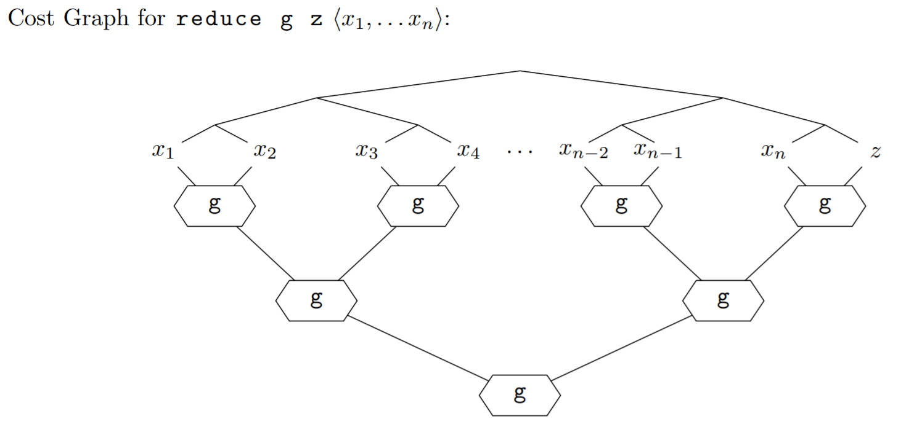

# Sequences

In programming, we often need to write fast algorithms that use enumerable collections. Currently we use the list datatype to represent enumerable collections. There are some crucial limitations of lists though.

A great application of SML's modules system is the sequence signature. The implementation of sequences (which is specific to 15150) allows for parallelism and accessing any element in O(1) time; it also comes with some helpful functions.

Similar to our notation for lists, our notation for sequences looks like `<x_1, x_2, x_3, ..., x_n>`.

## Sequences vs. Lists

Here are some advantages / disadvantages of sequences and lists. Considering sequences and lists purely from an algorithm-writing perspective, the only con of sequences is the slow cons operation.

| | Sequences | Lists |
| --- | --- | --- |
| Accessing element i | O(1) | O(i) |
| Parallelism | ✅ | ❌ |
| Pattern matching | ❌ | ✅ |
| cons operation | O(n) work | O(1) work |
| Writing proofs | Difficult | Relatively easy |

## Important sequence functions

Some frequently used sequence functions are `nth`, `tabulate`, `map`, `filter`, and `reduce`. For a comprehensive documentation of the sequence library, see http://www.cs.cmu.edu/~15150/resources/libraries/sequence.pdf. The following section will define each of the functions, give examples of their usage, and analyze their work and span.

### `Seq.nth`

The function `Seq.nth` allows for extracting any element from a sequence in O(1) work and span. This is a significant advantage over lists, which could take up to O(n) work and span, in the case of finding the last element of the list. `Seq.nth` has type `'a seq -> int -> 'a seq`.

An example: Let's say the sequence `S` is bound to the value `<0, 1, 2>`, which has type `int seq`. Then,
* `Seq.nth S 0` evaluates to `0`
* `Seq.nth S 2` evaluates to `2`
* `Seq.nth S 5` raises an exception `Range`, which occurs when the index is too large or small.

### `Seq.tabulate`

This is a very common tool for constructing a sequence. The type of `Seq.tabulate` is `(int -> 'a) -> int -> 'a seq`. The first argument is a function which maps an index to a value, and the second argument is an integer specifying the length of the sequence. In general:

```Seq.tabulate f n ==> <f 0, f 1, f 2, ..., f (n-1)>```

As a concrete example:

```Seq.tabulate (fn i => i) 5 ==> <0, 1, 2, 3, 4>```

Let's try writing a function that reverses a sequence. For example,

```reverse <0, 1, 2, 3, 4> ==> <4, 3, 2, 1, 0>```

This function `reverse` would have type `'a seq -> 'a seq`. In the above example, we have a sequence of length 5. The element at index 0 moves to index 4, the element at index 1 moves to index 3, ..., the element at index 4 moves to index 0. Generally, if the sequence has length `n`, the element at index `i` should move to `n - i - 1`. It's pretty easy to make off-by-one errors here, so be careful and test sequence functions thoroughly! The implementation of `reverse` is as follows:

```
fun reverse S =
  let
    val n = Seq.length S
  in
    Seq.tabulate (fn i => Seq.nth S (n-i-1)) n
  end
```

It's also possible to write functions that deal with nested sequences. Let's write a function `multtable : int -> int seq seq` that, when given a positive integer `n`, makes an `n` by `n` multiplication table. For example,

```
multtable 5 ==>
<<0,0,0,0,0>,
 <0,1,2,3,4>,
 <0,2,4,6,8>,
 <0,3,6,9,12>,
 <0,4,8,12,16>>
```

This time, the function that we're tabulating with needs to output a sequence, like `<0,2,4,6,8>`.

Here is the implementation:
```
fun multtable n =
  Seq.tabulate (fn i =>
    Seq.tabulate (fn j => i*j) n) n
```

Let's analyze the work of `multtable`. The function `(fn i => Seq.tabulate (fn j => i*j) n)` has `O(n)` work. This is since the function evaluates `i*j` (for different values of `j`) `n` times. The function is called `n` times (from the outer tabulate). Therefore, the total work of this function is `O(n^2)`.

For the span analysis, note that the function `(fn i => Seq.tabulate (fn j => i*j) n)` has `O(1)` span, because `i*j` is evaluated in parallel for all the different values of `j`. Then, the entire function has `O(1)` span because the function `(fn i => Seq.tabulate (fn j => i*j) n)` is called all in parallel.

### `Seq.map`

`Seq.map` is similar to `List.map`. The type of `Seq.map` is `('a -> 'b) -> 'a seq -> 'b seq`. Given a function `f : 'a -> 'b` and a sequence `<x_1, x_2, x_3, ..., x_n> : 'a seq`, we have:

```
Seq.map f <x_1, x_2, x_3, ..., x_n> = <f x_1, f x_2, f x_3, ..., f x_n>
```

The work of evaluating the above expression is (work of doing `f x_1`) + (work of doing `f x_2`) + ... + (work of doing `f x_n`).
The calls `f x_1, f x_2, f x_3, ..., f x_n` are all done in parallel. So, the span is the max of (span of doing `f x_1`, span of doing `f x_2`, ..., span of doing `f x_n`).

### `Seq.reduce`

`Seq.reduce` is like `List.foldr`, but with sequences. The type is `Seq.reduce : ('a * 'a -> 'a) -> 'a -> 'a seq -> 'a`. In English, `Seq.reduce` takes in a combining function, a base value, and a sequence to "reduce". For example, `Seq.reduce g z <x_0, x_1, x_2, ..., x_n>` is extensionally equivalent to `g(x_0, g(x_1, g(x_2, ..., g(x_n, z)))... )`. Notice that the combining function is `'a * 'a -> 'a` instead of `'a * 'b -> 'b`, as in `List.foldr`.

The neat part is, `Seq.reduce` also supports parallelism. In particular, when a combining function `g` has constant span, then `Seq.reduce g z S` has O(log |S|) span. We pay a slight cost: the function `g` must be associative, which means that `g(g(a,b),c) = g(a,g(b,c))` for all `a,b,c`. Furthermore, `z` must be the identity for `g`, which means `g(a,z) = g(z,a) = a` for all `a`.

To analyze the work and span, let's consider how SML actually evaluates `Seq.reduce g z S`. It first calls the combining function `g` on each pair of elements: `x_0` and `x_1`, `x_2` and `x_3`, and so on. All of these calls can be made in parallel. Then, we combine the intermediate results together. At the very end, all of the elements of `S` will be combined together.

<figure class="aligncenter">
    
    <figcaption>The cost graph for `Seq.reduce`. Each branch at the top represents a different independent task for the processor(s) to perform.  </figcaption>
</figure>

The work is the sum of doing all the work shown in the cost graph, while the span is the longest path through the cost graph. Therefore, for constant `g`, the work of `Seq.reduce g z S` is O(|S|), and the span is O(log |S|).

An example of using this function is finding the sum of a sequence. So, `Seq.reduce (op +) 0 <1, 2, 3, 4>` evaluates to `10`.

### `Seq.filter`


## Examples of functions involving sequences


## Exercise: Pascal's triangle

Our task is to write a function `pascal : int -> int seq seq`. Given a nonnegative integer `n`, `pascal n` evaluates to the first `n+1` rows of Pascal's triangle. For example:
```
pascal 5 =
<<1>,
 <1,1>,
 <1,2,1>,
 <1,3,3,1>,
 <1,4,6,4,1>,
 <1,5,10,10,5,1>>
```


```
fun pascalH 0 = [Seq.singleton 1]
  | pascalH n =
    let
      val (prev::rest) = pascalH (n-1)
      fun rowmaker 0 = 1
        | rowmaker i =
          if i = n then 1
          else Seq.nth prev i + Seq.nth prev (i-1)
      val new = Seq.tabulate rowmaker (n+1)
    in
      new::prev::rest
    end

fun pascal n = Seq.reverse (Seq.fromList (pascalH n))
```